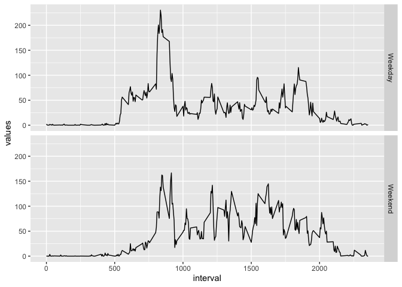

Reading the file and processing
-------------------------------

    data = read.csv("activity.csv")
    data$date = as.Date(data$date, format = "%Y-%m-%d")
    data$interval = as.factor(data$interval)

What is the total number of steps per day?
------------------------------------------

    # plotting the number of steps per day

    plot(data$date, data$steps, type = "h") 

    # calculating the mean and median for each day

    mn = with(data, tapply(steps, date, mean))
    med = with(data, tapply(steps, date, median))
    dat = unique(data$date)
    data1 = data.frame(date = dat, mean = mn, median = med)

    # plotting the mean

    par(mfrow = c(1,2), mar = c(2, 2, 1, 1))
    with(data1, plot(date, mean, pch = 19, type = "l", ylab = "steps"))
    with(data1, plot(date, median, pch = 19, type = "l"))

There’s 8 days that the all the observations are NA.

    subset(data1, is.na(data1$mean))

    ##                  date mean median
    ## 2012-10-01 2012-10-01   NA     NA
    ## 2012-10-08 2012-10-08   NA     NA
    ## 2012-11-01 2012-11-01   NA     NA
    ## 2012-11-04 2012-11-04   NA     NA
    ## 2012-11-09 2012-11-09   NA     NA
    ## 2012-11-10 2012-11-10   NA     NA
    ## 2012-11-14 2012-11-14   NA     NA
    ## 2012-11-30 2012-11-30   NA     NA

All the median of the other days are equal to 0, because the non zero
observations are less frequent than the zero observations.

    d = "2012-11-03"
    z = sum(data$steps[data$date == d] == 0)
    nZ = sum(!data$steps[data$date == d] == 0)

For example, on day 2012-11-03 there is 198 observations and only 90 non
zero obsevations

What is the average daily pattern?
----------------------------------

    mn_int = with(data, tapply(steps, interval, mean, na.rm = TRUE))
    pat = data.frame(interval = unique(data$interval), mean = mn_int)
    with(pat, plot(interval, mn_int, type = "l"))

    m = max(mn_int)
    int = pat$interval[which.max(mn_int)]

The maximum number of steps were on interval 835 and the max average
number of steps were 206.1698113

Imputting missing values
------------------------

    n = sum(is.na(data$steps))

The total number of missing (NA) step values is 2304.

The strategy to add values to the NA observations is to use the mean for
the same 5 minute interval. This was choosen because there are days,
actually 8 days, with all the observations equals NA.

    # creating new data frame
    data0 = data

    # inserting missing values
    for (i in 1:nrow(data0)) {
            if (is.na(data0$steps[i])) {
                    data0$steps[i] = mean(data0$steps[data0$interval == data0$interval[i]], na.rm = TRUE)
            }
    }

    # plotting the number of steps per day
    plot(data0$date, data0$steps, type = "h") 

    # calculating the mean and median for each day

    mn0 = with(data0, tapply(steps, date, mean))
    med0 = with(data0, tapply(steps, date, median))
    dat0 = unique(data0$date)
    data2 = data.frame(date = dat0, mean = mn0, median = med0)

    # plotting the mean

    par(mfrow = c(1,2), mar = c(2, 2, 1, 1))
    with(data2, plot(date, mean, pch = 19, type = "l"))
    with(data2, plot(date, median, pch = 19, type = "l"))

As we can see on the graphics, all the days now have values. The values
for the days that were completly without observations (NA) are equal to
the gereral mean. The median for these days have a positive and equal
value because there are no more zeros on the observations for these
days.

Are there diferences in activity patterns between weekdays and weekends?
------------------------------------------------------------------------

    # adding a column with the weekday
    data0$weekday = weekdays(data0$date, abbreviate = TRUE)

    # defining factor weekday or weekend
    for (i in 1:nrow(data0)) {
            if (data0$weekday[i] == "Sáb" || data0$weekday[i] == "Dom") {data0$week[i] = "Weekend"} else {data0$week[i] = "Weekday"}
    }
    data0$week = as.factor(data0$week)

    # calculating the mean per type of day and interval and setting the data frame
    mn1 = with(data0, tapply(steps, list(interval, week), mean))
    mn1 = as.data.frame(mn1)
    int1 = rownames(mn1)
    mn1 = stack(mn1)
    mn1$interval = as.numeric(int1)

    # gerenating the graphic
    library(ggplot2)
    qplot(interval, values, data = mn1, facets = ind~., geom = "line")

As we can see from the graphic above on weekdays there’s more step in
average on the begining and on the end of the intervals, but on the
middle range of the intervals it seems that there’s more steps on
avarage on weekends.
